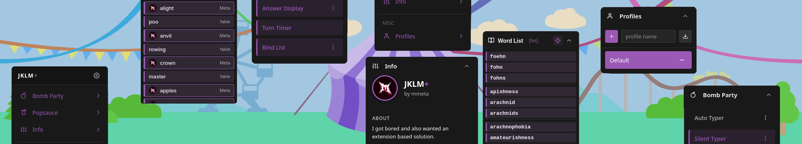
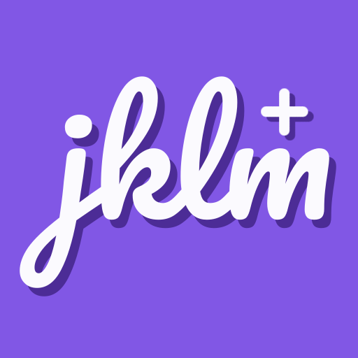
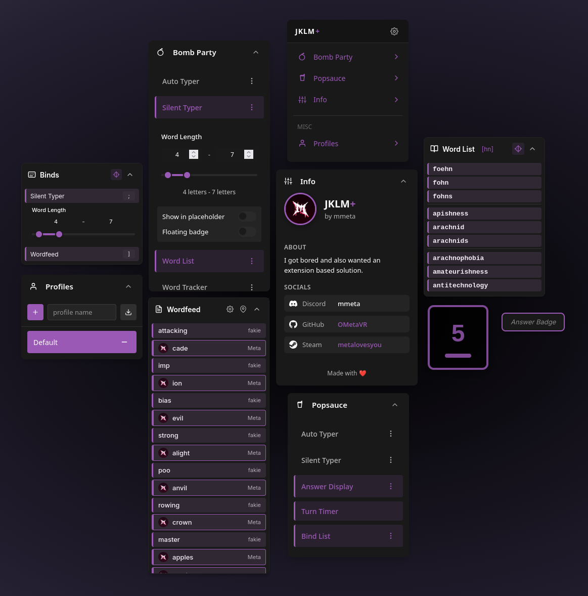
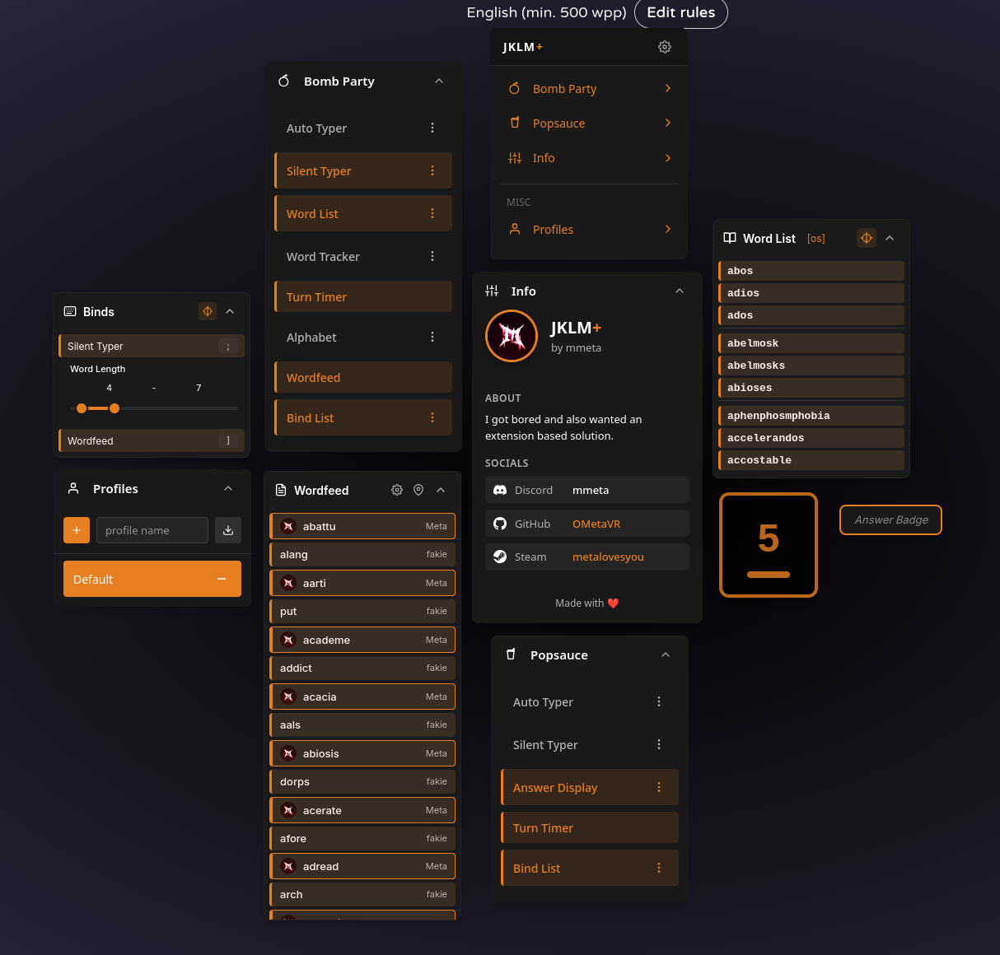
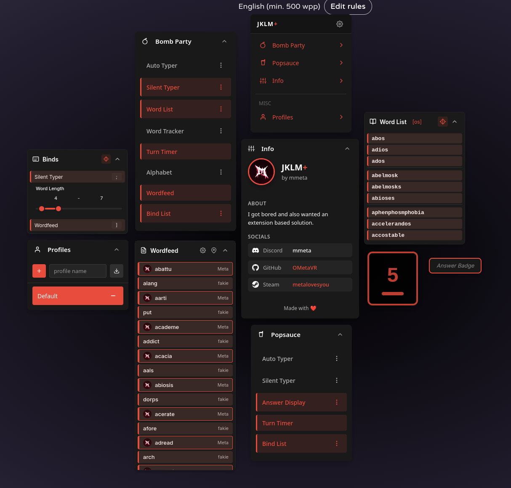
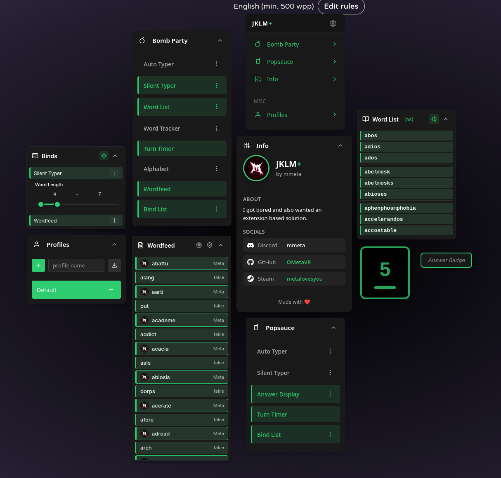
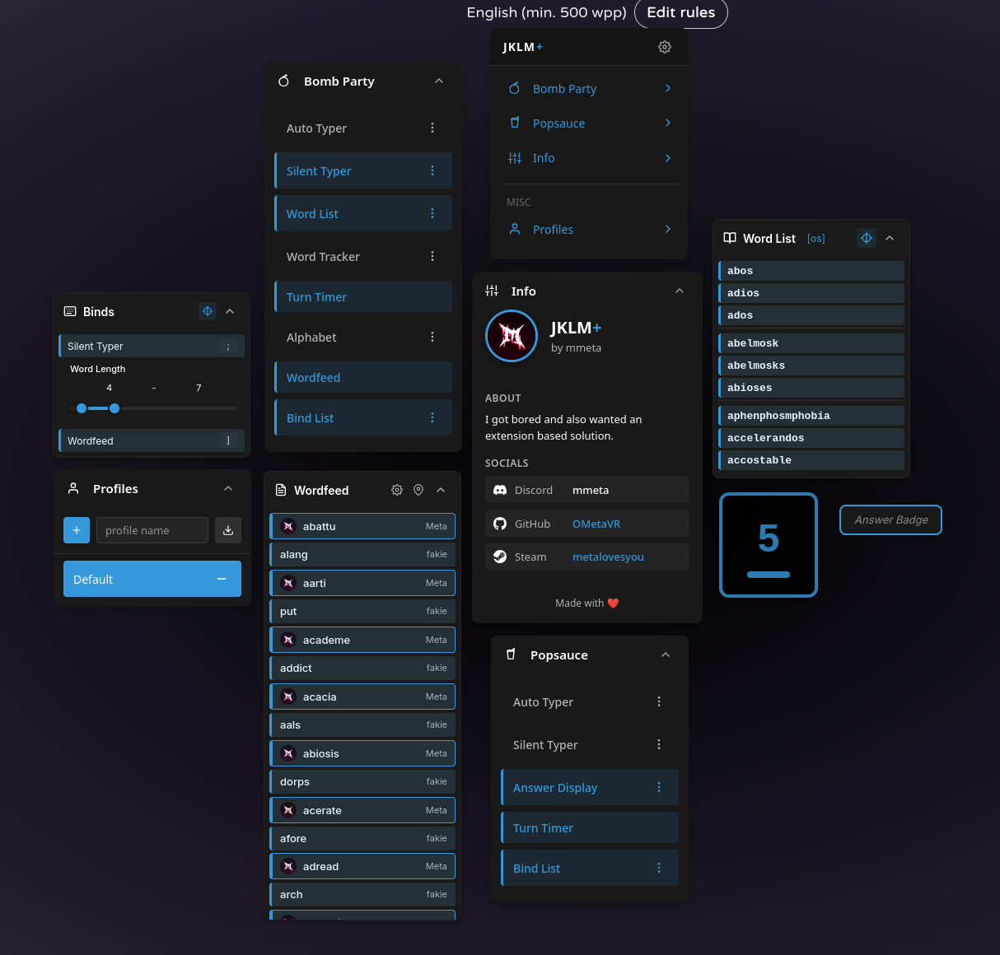

<p align="center">
  
</p>

<p align="center">
  <strong>The ultimate enhancement suite for JKLM.fun</strong><br>
  A Firefox extension that gives you way more than just auto answer.
</p>

---

<p align="center">
<strong>⚠️ WARNING⚠️ </strong>
</p>
<p align="center">
I am not responsible for any actions taken towards you for using this tool in public lobbies.
</p>

## What is this?

|  | JKLM+ adds a ton of "quality-of-life" features to JKLM.fun games like Bomb Party and Popsauce. Whether you want word suggestions, auto-typing, game stats tracking, or just wanna destroy your friends, we got you! |
|:---:|:---|

## Features

### Bomb Party
- **Word List** - Shows words containing the current syllable, filterable by length
- **Auto Typer** - Types words automatically with customizable speed and reaction time
- **Silent Typer** - Intercepts key presses to automatically type the word in your timing
- **Word Tracker** - Keeps track of words you've used as well as enemies
- **Alphabet Tracker** - Shows and actively targets which letters you still need to use for a life gain
- **Turn Timer** - Visual minimum amount of time for your turn
- **Wordfeed** - Sort of like a killfeed but for the words being submitted (purely visual)

### Popsauce
- **Answer Display** - Shows known answers for questions you've seen before or that are already in the database
- **Auto Typer** - Automatically types answers when detected
- **Silent Typer** - Click to type answers
- **Answer Learning** - Passively learns new answers from you and other players, with import/export capabilities

### General
- **Profiles** - Save and switch between different settings configurations (its a config system)
- **Bind List** - Quick access panel showing all your keybinds and some settings for specific features you may want to change on the fly
- **Discord Webhooks** - Log game results to a Discord channel
- **Themes** - Dark/light mode with customizable accent colors
- **Draggable Panels** - Move everything where you want it (save per profile)
- **Keybinds** - Set hotkeys for any feature

## Pictures
<details>
<summary>Purple themed</summary>

</details>
<details>
<summary>Yellow themed</summary>

</details>
<details>
<summary>Orange themed</summary>

</details>
<details>
<summary>Green themed</summary>

</details>
<details>
<summary>Blue themed</summary>

</details>

## Installation

### From Source

1. Clone or download this repo
2. Install dependencies:
   ```bash
   npm install
   ```
3. Build:
   ```bash
   npm run build
   ```
4. Load in Firefox:
   - Go to `about:debugging`
   - Click "This Firefox"
   - Click "Load Temporary Add-on"
   - Select `manifest.json` from the JKLM+ folder

### Permanent Install

Package the extension as an `.xpi` file. If you don't know how to install an xpi file then google it.

## Usage

1. Go to [jklm.fun](https://jklm.fun)
2. Join or create a game
3. Press the menu keybind (default: backtick `` ` ``) to toggle the menu
4. Enable the features you want from the panels

## Settings

Access settings through the gear icon in the nav panel:

- **General** - Auto-save, wordlist URL, import/export answers
- **GUI** - Theme, animations, hide titlebars
- **Notifications** - Discord webhook configuration
- **Developer** - Debug logging, reset positions

## Contributing

Found a bug? Want a feature? Open an issue or PR.

## License

Do whatever you want with it under the [license](/LICENSE.md). Just don't be a dick about it and no claiming it as your own or trying to somehow sell it.

## Thanks

- VapeClient - if you cant tell the UI is heavily based on it ("heavily" means a near 1:1 ripoff). I just really didn't feel like making my own design.
- Dot - Told me I wouldn't finish it because I can't ever seem to finish projects... he's right this is just an exception

<p align="center">
<strong>⚠️ WARNING⚠️ </strong>
</p>
<p align="center">
I am not responsible for any actions taken towards you for using this tool in public lobbies.
</p>
